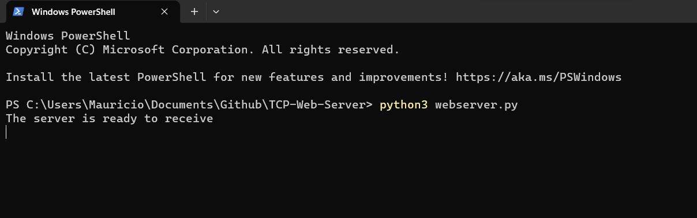
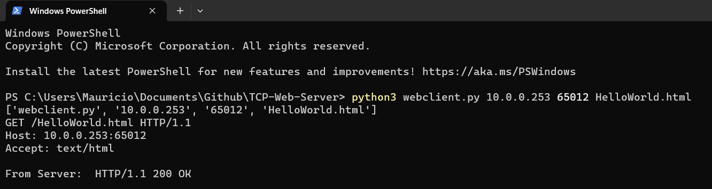
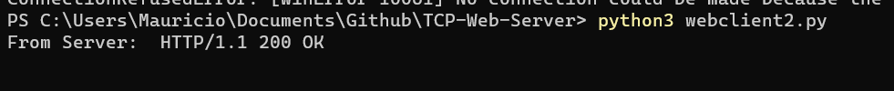
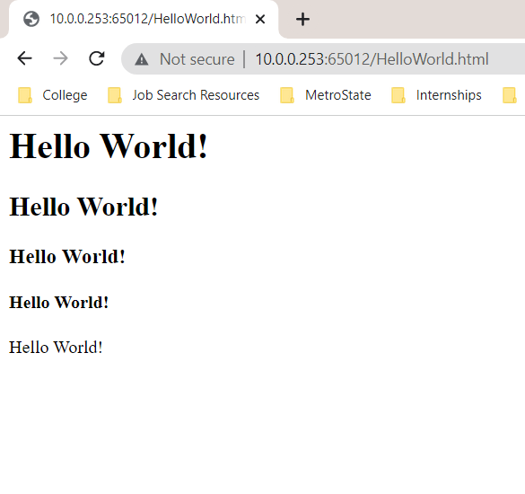
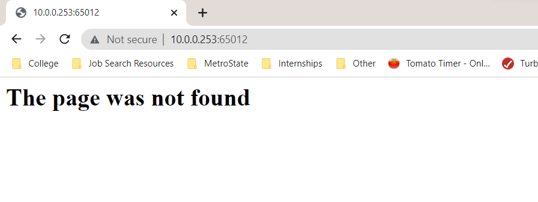

# TCP-Web-Server
A TCP web server. Demonstration of work done in ICS 462 - Networks and Security.

## Runnning the Web Server
The web server can be run by ```python3 webserver.py```. This will create a localhost server that listens on port 65012.

## Running the Web Client
I have included two clients, webclient.py and webclient2.py. The first one can be run by ```python3 webclient.py <server_host> <server_port> <filename>```. In this case, server_host is the IP address of the host server, server port is 65012 and file name is HelloWorld.html. 

The second client, webclient2.py does not require any arguments, since they are hard coded. It can be run with ```python3 webclient2.py```.

## Demonstration




### When the correct page loads


### 404 Error page

